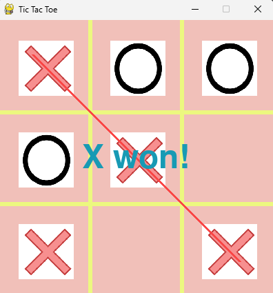
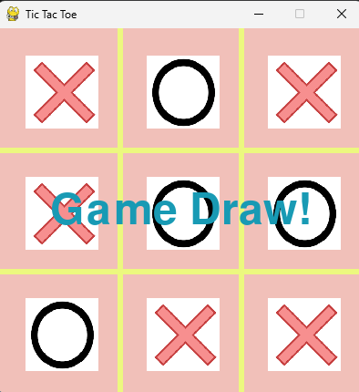
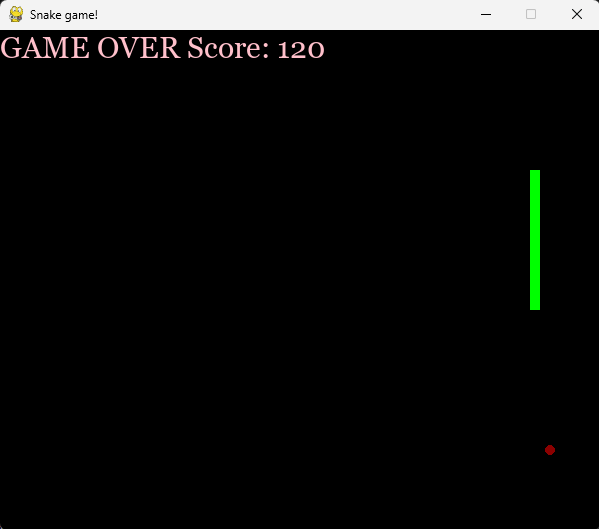

# 🎮 Python Game Collection

A collection of classic games developed using **Python and Pygame**.

This project currently includes two simple and interactive games:

* ❌⭕ **Tic-Tac-Toe**
* 🐍 **Snake Game**

The project demonstrates basic game development concepts using Python, including game loops, event handling, keyboard and mouse input, collision detection, score management, and graphical elements.

---

## 🕹️ Games Included

### ❌⭕ Tic-Tac-Toe

A classic two-player Tic-Tac-Toe game played on a 3×3 board.

#### Features

* 3×3 game board
* Two-player gameplay
* X and O turns
* Mouse-based cell selection
* Winner detection
* Draw detection
* Winning line display
* Visual game result

The game checks winning combinations across rows, columns, and diagonals.

---

### 🐍 Snake Game

A classic Snake game where the player controls a snake, collects food, and increases the score.

#### Features

* Keyboard-controlled movement
* Randomly generated food
* Score system
* Snake growth after eating food
* Wall collision detection
* Self-collision detection
* Game Over screen
* Score display

---

## ✨ Project Features

* 🎮 Two classic games in one project
* 🐍 Interactive Snake gameplay
* ❌⭕ Interactive Tic-Tac-Toe gameplay
* 🖱️ Mouse controls for Tic-Tac-Toe
* ⌨️ Keyboard controls for Snake
* 🏆 Winner and draw detection
* 📊 Score tracking
* 💻 Simple Python/Pygame implementation
* 📸 Gameplay screenshots included

---

## 🛠️ Technologies Used

* **Python**
* **Pygame**
* `random` module
* `time` module

---

## 📁 Project Structure

```text
Python-Game-Collection/
│
├── image/
│   ├── tic-tac-toe-win.png
│   ├── tic-tac-toe-draw.png
│   └── snake-game.png
│
├── O.png
├── X.png
├── snake.py
├── tictactoe.py
├── requirements.txt
├── README.md
├── .gitignore
└── LICENSE
```

### File Description

| File / Folder      | Description                  |
| ------------------ | ---------------------------- |
| `tictactoe.py`     | Tic-Tac-Toe game             |
| `snake.py`         | Snake game                   |
| `X.png`            | X symbol used in Tic-Tac-Toe |
| `O.png`            | O symbol used in Tic-Tac-Toe |
| `image/`           | Gameplay screenshots         |
| `requirements.txt` | Required Python package      |
| `README.md`        | Project documentation        |
| `.gitignore`       | Files ignored by Git         |
| `LICENSE`          | MIT License                  |

---

## 🎮 Download & Play

Want to play the games **without installing Python or Pygame**?

Download the latest Windows release:

👉 **[Download Python Game Collection v1.0.0](https://github.com/Aks870/Python-Game-Collection/releases/tag/v1.0.0)**

### Available Games

* 🐍 **Snake Game** — Download `snake.exe`
* ❌⭕ **Tic-Tac-Toe** — Download `tictactoe.exe`

### How to Play

1. Open the release page.
2. Download the `.exe` file of the game you want to play.
3. Double-click the downloaded `.exe` file.
4. Start playing! 🎮

> **Note:** Windows may show a security warning when running an `.exe` downloaded from the internet. If you trust the source, choose the option to continue running the application.

---

## ⚙️ Installation

### 1. Clone the Repository

Clone this repository using Git:

```bash
git clone https://github.com/Aks870/Python-Game-Collection.git
```

### 2. Open the Project Folder

```bash
cd Python-Game-Collection
```

### 3. Create a Virtual Environment

On Windows:

```powershell
python -m venv .venv
```

### 4. Activate the Virtual Environment

```powershell
.venv\Scripts\activate
```

### 5. Install Required Package

```powershell
pip install -r requirements.txt
```

---

## ▶️ How to Run

Make sure you are inside the `Python-Game-Collection` project folder.

### ❌⭕ Run Tic-Tac-Toe

```powershell
python tictactoe.py
```

Use the mouse to select the cells on the board.

---

### 🐍 Run Snake Game

```powershell
python snake.py
```

Use the arrow keys to control the snake.

---

## 🎯 Controls

### ❌⭕ Tic-Tac-Toe

| Action        | Control         |
| ------------- | --------------- |
| Select a cell | 🖱️ Mouse Click |

### 🐍 Snake Game

| Action     | Key |
| ---------- | --- |
| Move Up    | ⬆️  |
| Move Down  | ⬇️  |
| Move Left  | ⬅️  |
| Move Right | ➡️  |

---

## 📸 Screenshots

### ❌⭕ Tic-Tac-Toe — X Wins



### ❌⭕ Tic-Tac-Toe — Game Draw



### 🐍 Snake Game



---

## 🧠 What This Project Demonstrates

This project provides practical experience with:

* Python programming
* Pygame
* Game loops
* Event handling
* Mouse input
* Keyboard input
* Collision detection
* Random number generation
* Score management
* Basic game logic
* 2D graphics
* User interaction

---

## 🔮 Future Improvements

Possible improvements for future versions include:

* 🔄 Restart button
* 🔊 Sound effects
* 🎵 Background music
* 🎨 Improved graphical interface
* 📈 High-score system
* 🎚️ Difficulty levels
* 🤖 AI opponent for Tic-Tac-Toe
* ⏸️ Pause and resume functionality
* 🏠 Start menu
* ✨ Improved animations

---

## 📦 Requirements

The project currently requires:

```text
pygame
```

Install it using:

```powershell
pip install -r requirements.txt
```

---

## 📜 License

This project is licensed under the **MIT License**.

See the `LICENSE` file for more information.

---

## 👨‍💻 Author

**Ankit Singh**

Python | AI & ML | Machine Learning | Software Projects

---

## ⭐ Project

If you find this project useful or interesting, feel free to explore the code and try the games.
